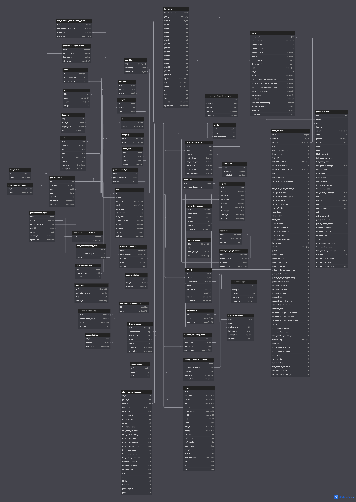

# Basket Lounge (Backend)

## 소개
- 농구 (특히 NBA)에 관한 정보를 제공하고 소통하는 커뮤니티입니다. 팬들끼리 소통하며 농구에 대한 정보를 공유하고, 농구에 대한 이야기를 나눌 수 있습니다.
- 해당 리포지토리는 Backend 코드만 포함하고 있습니다. Frontend 코드는 [여기](https://github.com/7jw92nVd1kLaq1/bl-frontend)에서 확인할 수 있습니다.

## 기능
- 농구 정보
  - NBA 팀 정보
    - 팀 로고, 팀 이름, 팀 별칭, 팀 설립 연도, 팀 본부, 팀 홈구장, 팀 소개 등을 확인할 수 있습니다.
  - NBA 선수 정보
    - 선수의 일반 정보 및 경기 기록을 확인할 수 있습니다.
  - NBA 경기 정보
    - 경기 일자, 경기 시간, 홈 팀, 원정 팀, 경기 결과, 경기 스코어 등을 확인할 수 있습니다.
- 실시간 경기 정보
  - NBA 경기 일정
    - 경기 일자, 경기 시간, 홈 팀, 원정 팀을 확인할 수 있습니다.
    - 날짜별로 필터링할 수 있습니다.
  - NBA 경기 결과
    - 경기 일자, 홈 팀, 원정 팀, 경기 결과
  - NBA 팀 순위
    - 팀 순위, 팀 로고, 팀 이름, 팀 승리 수, 팀 패배 수
  - 실시간 채팅
    - 실시간으로 경기에 대한 이야기를 나눌 수 있습니다.
- 게시판
  - 게시글 작성, 수정, 삭제
    - 게시글 제목, 게시글 내용, 게시글 작성자, 게시글 작성 시간, 게시글 좋아요 수 등을 확인할 수 있습니다.
    - 게시글을 좋아요 할 수 있습니다.
  - 댓글 작성, 수정, 삭제
    - 댓글 내용, 댓글 작성자, 댓글 작성 시간 등을 확인할 수 있습니다.
    - 댓글을 작성할 수 있습니다.
  - 게시글 검색
    - 다양한 기준으로 필터링할 수 있고, 제목, 내용을 검색할 수 있습니다.
- 타 사용자 정보
  - 다른 사용자의 소개 및 좋아요 수를 확인할 수 있습니다.
  - 다른 사용자의 프로필을 확인할 수 있습니다.
  - 다른 사용자의 게시글, 댓글을 확인할 수 있습니다.
- 회원가입, 로그인, 로그아웃
  - 소셜 로그인만 사용하여 회원가입을 할 수 있습니다.
  - JWT 토큰을 이용한 인증/인가 시스템을 사용합니다.
- 관리자
  - 관리자는 모든 사용자의 정보를 확인할 수 있습니다.
  - 관리자는 모든 게시글, 댓글을 확인할 수 있습니다.
  - 관리자는 일반 사용자의 정보를 수정할 수 있습니다.
  - 관리자는 일반 사용자의 게시글, 댓글을 삭제할 수 있습니다.

## 미래 계획
- 알림 기능
  - 사용자가 좋아요를 받거나 댓글을 받았을 때 알림을 받을 수 있습니다.
- 더 많은 농구 정보
  - NBA 이외의 다른 리그 정보를 제공합니다.
- 더 많은 게시판 기능
  - 게시글에 이미지를 첨부할 수 있습니다.
  - 게시글에 해시태그를 추가할 수 있습니다.

## [DB 모델링](https://dbdiagram.io/d/66d810a8eef7e08f0ea2a34e)


## 설치 방법 (Linux/macOS 개발 환경 세팅)
1. 해당 리포지토리를 클론합니다.
  ```bash
  git clone https://github.com/7jw92nVd1kLaq1/bl-backend.git
  ```
2. 가상 환경을 생성하고 활성화합니다.
  ```bash
  python -m venv venv
  source venv/bin/activate
  ```
3. 필요한 패키지를 설치합니다.
  ```bash
  pip install -r requirements.txt
  ```
4. DB를 위한 PostgreSQL 컨테이너를 다음 명령어로 실행합니다. 반드시 POSTGRES_PASSWORD와 호스트 저장 디렉토리를 설정해야 합니다.
  ```bash
  docker run -d -p 127.0.0.1:5432:5432 --name some-postgres -e POSTGRES_PASSWORD=[postgres 유저 비밀번호] -v [호스트 저장 디렉토리]:/var/lib/postgresql/data postgres:17.0-alpine3.20
  ```
5. Redis 컨테이너를 실행합니다.
  ```bash
  docker run -d -p 6379:6379 -it redis/redis-stack:latest
  ```
6. 실시간 채팅에 관련된 개발을 진행할 경우, WebSocket 통신을 위한 Centrifugo 컨테이너를 실행합니다. 설정 파일을 수정하고 실행할 경우, Centrifugo의 [공식 문서](https://centrifugal.dev/docs/getting-started/installation)를 참고하세요.
  ```bash
  # Centrifugo의 config 파일을 생성합니다.
  docker run --rm -v [Centrifugo 설정 파일 저장 공간]:/centrifugo centrifugo/centrifugo:v5 centrifugo genconfig
  # Centrifugo 컨테이너를 실행합니다. [Centrifugo 설정 파일 저장 공간]에는 Centrifugo 설정 파일이 저장된 디렉토리를 입력합니다.
  docker run --rm --ulimit nofile=262144:262144 -v [Centrifugo 설정 파일 저장 공간]:/centrifugo -p 8000:8000 centrifugo/centrifugo:v5 centrifugo -c config.json
  ```
7. .env 파일을 생성하고, 환경 변수를 설정합니다. 다음 링크에서 Google OAuth 2.0 클라이언트 ID와 시크릿을 발급받아 설정합니다. [Google Cloud Console](https://developers.google.com/identity/sign-in/web/sign-in)
  ```bash
   touch .env
  ```
  ```env
  DJANGO_SECRET_KEY=<your_secret_key>
  DB_NAME=<your_db_name>
  DB_USER=postgres
  DB_PASSWORD=<postgres 유저 비밀번호>
  DB_HOST=127.0.0.1
  DB_PORT=5432

  # 소셜 로그인을 위한 구글 클라이언트 ID, 시크릿을 설정합니다.
  GOOGLE_CLIENT_ID=<your_google_client_id>
  GOOGLE_CLIENT_SECRET=<your_google_client_secret>

  # 프론트엔드 URL을 설정합니다. (ex. http://localhost:3000)
  FRONTEND_URL=<프론트엔드 URL>
  
  # Celery를 위한 Redis URL을 설정합니다.
  REDIS_URL=redis://127.0.0.1:6379
  CELERY_BROKER_URL=redis://127.0.0.1:6379/0
  CELERY_RESULT_BACKEND=redis://127.0.0.1:6379/0
  
  # WebSocket을 위한 Centrifugo API Key를 설정합니다.
  CENTRIFUGO_API_KEY=<your_centrifugo_api_key>
  ```
8. Django DB 마이그레이션을 진행합니다.
  ```bash
  DEVELOPMENT=True python3 manage.py migrate
  ```
9. Django 서버를 실행합니다.
  ```bash
  DEVELOPMENT=True python3 manage.py runserver
  ```
10. 스케쥴링을 위한 Celery Beat를 실행합니다.
  ```bash
  DEVELOPMENT=True celery -A config worker -l info
  ```
11. 각 큐에 대한 Celery Worker를 각 bash 창에서 실행합니다.
  ```bash
  DEVELOPMENT=True celery -A backend worker --loglevel=info --concurrency=3 -n high-priority-worker1@%h -Q high_priority
  DEVELOPMENT=True celery -A backend worker --loglevel=info --concurrency=1 -n low-priority-worker1@%h -Q low_priority
  DEVELOPMENT=True celery -A backend worker --loglevel=info --concurrency=3 -n today-game-update-worker1@%h -Q today_game_update
  ```

## 사용 기술
- Backend
  - Django
  - Celery
  - Django REST framework
  - Simple JWT
  - dj-rest-auth
  - django-allauth
- DevOps
  - Docker
  - Gunicorn
  - Redis
  - PostgreSQL
  - Centrifugo